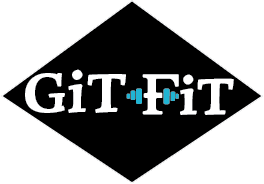

## Description

Git-Fit is an app that is used by recording your personal workout/excercise information for you to look back on in the future

https://enigmatic-garden-97881-5a06f2d72820.herokuapp.com/

## User Story

 As someone that wants to keep better care of myself, I want to have a way to record my workouts so that I can look back and view my progress. 

## Table of Contents

* [Usage](#usage)
* [Acceptance Criteria](#Acceptance-Criteria)
* [Credits](#Credits)
* [License](#License)

## Usage 

After accessing the app, the user will then log in or sign up, depending on if they have an account already or not.
Once logged in, the user will then be able to add a new workout from their homepage.
When the "add workout" button is pushed, a form is pulled up and the user is prompted to fill out all fields.
After the workout is added, the user is taken back to the homepage where they will see the newly added workout.
The user can then click on the individual workout if they would like to edit or delete the submission.

## Acceptance Criteria
With your group, you’ll again conceive and execute a design that solves a real-world problem. In creating your first collaborative MERN-stack single-page application, you’ll combine a scalable MongoDB back end, a GraphQL API, and an Express.js and Node.js server with a React front end, implementing user authentication with JWT to build a user-focused platform. You’ll continue to build on the agile development methodologies you’ve used throughout this course. These include storing your project code in GitHub, managing your work with a project management tool, and implementing feature and bug fixes using the Git branch workflow and pull requests.

For this project, you should start from scratch. Doing so will allow you to revisit your front-end abilities in the context of React and solidify your understanding of working with multiple servers in a MERN application. Your skills have continued to improve since the first two projects, so naturally your approach will be different considering the experience you’ve gained with each new application you’ve built.

Your group will use everything you’ve learned throughout this course to create a MERN-stack single-page application that works with real-world data to solve a real-world challenge, with a focus on data and user demand. This project will provide you with the best opportunity to demonstrate your problem-solving skills, which employers will want to observe. Once again, the user story and acceptance criteria will depend on the project that you create, but your project must fulfill the following requirements:

* Use React for the front end.

* Use GraphQL with a Node.js and Express.js server.

* Use MongoDB and the Mongoose ODM for the database.

* Use queries and mutations for retrieving, adding, updating, and deleting data.

* Be deployed using Heroku (with data).

* Have a polished UI.

* Be responsive.

* Be interactive (i.e., accept and respond to user input).

* Include authentication (JWT).

* Protect sensitive API key information on the server.

* Have a clean repository that meets quality coding standards (file structure, naming conventions, best practices for class and id naming conventions, indentation, high-quality comments, and so on).

* Have a high-quality README (with unique name, description, technologies used, screenshot, and link to deployed application).

## Credits

## License

MIT
